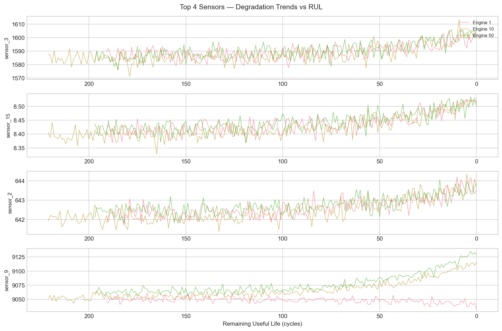
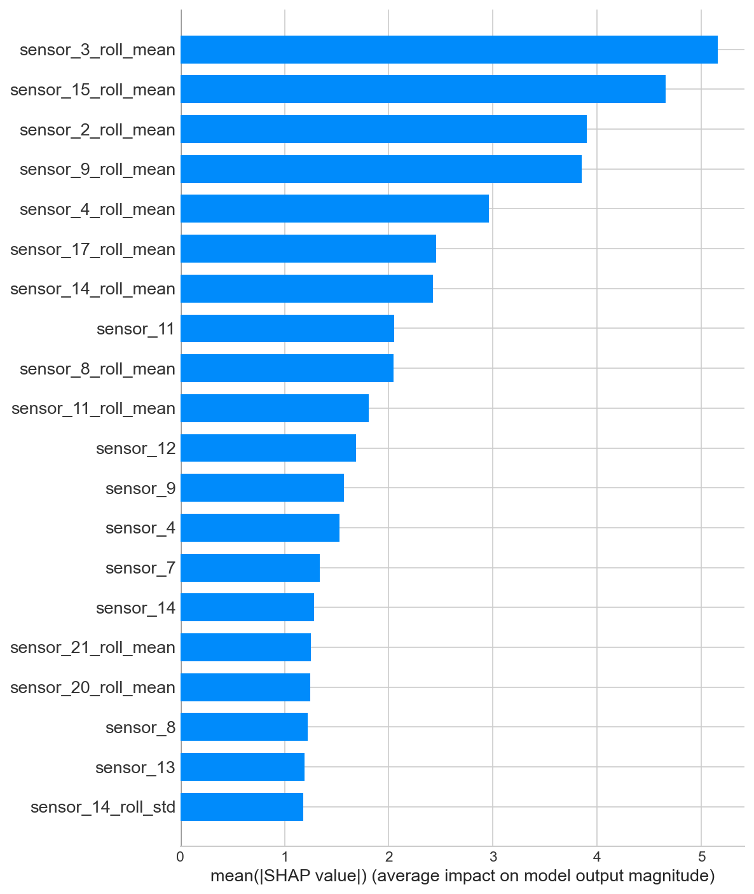

# Fleet Maintenance — Remaining Useful Life (RUL) Prediction

Predicting when a turbofan engine will fail before it happens — using NASA sensor data,
classical machine learning, and explainable AI.

## Overview

Unplanned equipment failure is one of the most costly problems in aerospace and industrial
operations. This project builds a predictive maintenance model that estimates the
**Remaining Useful Life (RUL)** of turbofan engines — the number of operating cycles left
before failure — using multivariate sensor time series data.

The dataset is the [NASA C-MAPSS Turbofan Engine Degradation Simulation Dataset](https://ti.arc.nasa.gov/tech/dash/groups/pcoe/prognostic-data-repository/#turbofan),
a widely used benchmark in prognostics and health management (PHM) research. It contains
run-to-failure sensor readings from 100 simulated engines across 21 sensors.

## Technical Approach

The project follows a full end-to-end classical ML pipeline:

1. **EDA & Sensor Selection** — 7 near-constant sensors were identified and removed through
variance analysis, validated visually by aligning each sensor's degradation trajectory
against RUL. Only sensors showing a consistent directional trend approaching failure were
retained.

2. **Target Engineering** — Rather than assuming a linear RUL target blindly, the degradation
onset was identified visually using cross-engine sensor averages. A capped RUL target of 125
cycles was selected empirically by comparing model performance across cap values of 125, 150,
175, and 200.

3. **Feature Engineering** — Rolling mean and standard deviation features (window = 15 cycles)
were added per engine to capture recent degradation trends. Window size was selected by
comparing Linear Regression performance across windows of 5, 10, and 15 cycles.

4. **Model Comparison** — Four models were trained and evaluated: Linear Regression, Random
Forest, XGBoost, and LightGBM. Tree-based models were tuned through structured manual
configuration search focusing on regularisation parameters.

5. **Explainability** — SHAP (SHapley Additive exPlanations) analysis was applied to the
best model to explain both global feature importance and individual engine predictions.

## Results

| Model | RMSE Test | R² Test |
|-------|-----------|---------|
| Linear Regression (baseline) | 20.82 | 0.73 |
| Linear Regression (capped + rolling features) | 20.09 | 0.75 |
| Random Forest (tuned) | 19.93 | 0.75 |
| LightGBM (tuned) | 17.99 | 0.80 |
| **XGBoost (tuned)** | **17.33** | **0.81** |

The final XGBoost model achieves a **16.8% reduction in RMSE** over the baseline through
three successive improvements: target capping, rolling feature engineering, and gradient
boosting with regularisation.

## Key Findings

- Rolling mean features dominate the SHAP importance ranking — the model reasons primarily
from recent sensor trends rather than instantaneous readings, confirming that degradation
is a gradual process best captured through temporal context.
- `sensor_3_roll_mean`, `sensor_15_roll_mean`, `sensor_2_roll_mean`, and `sensor_9_roll_mean`
account for the majority of predictive signal, with roughly double the impact of all other features.
- Engine degradation is not a sudden event — a subtle upward drift begins around RUL 200
and accelerates sharply after RUL 50, motivating the capped target approach.
- XGBoost with shallow trees (`max_depth=3`) and moderate subsampling outperformed all other
models, consistent with recent literature on gradient boosting for predictive maintenance.

## Plots

### Sensor Degradation Trends vs RUL


### Model Comparison


### SHAP Summary Plot


## How to Run
```bash
# Clone the repository
git clone https://github.com/alejandravicaria/fleet-maintenance-rul-prediction.git
cd fleet-maintenance-rul-prediction

# Create a virtual environment
python -m venv venv
source venv/bin/activate  # on Windows: venv\Scripts\activate

# Install dependencies
pip install -r requirements.txt

# Download the dataset
# Get it from: https://ti.arc.nasa.gov/tech/dash/groups/pcoe/prognostic-data-repository/#turbofan
# Place the files in the /data folder

# Run the notebook
jupyter notebook notebooks/01_eda_and_modeling.ipynb
```

## Repository Structure
```
├── data/                  # Raw dataset files (not committed)
├── notebooks/
│   └── 01_eda_and_modeling.ipynb
├── images/                # Plot screenshots for README
├── requirements.txt
└── README.md
```

## Stack

Python · scikit-learn · XGBoost · LightGBM · SHAP · pandas · matplotlib · seaborn
